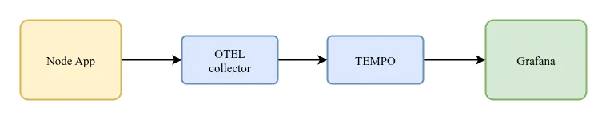

# Opentelemetry + Tempo + Grafana Workshop

## Flow Graph



## User Guide

### Clone Repository

```bash
git clone https://github.com/REZ0AN/otel-tempo-workshop.git

cd otel-tempo-workshop
```
### Run Docker Compose File

```bash
docker compose up --build
```
**Note**: Ensure that ports `5010`, `4318`, `3200`, and `3000` are available on the host machine. If any of these ports are already in use, adjust the host port mappings accordingly.

### Testing

#### 1. Login to Grafana

Use the following credentials to access Grafana:

```bash
Username: admin
Password: admin
```

After logging in, navigate to the dashboard. The default dashboard **Tracer-APP-Dashboard** will be available, but initially it may display **No Data**.

> **Note:** Ensure that all required services (`node-app`, `collector`, `tempo`, `grafana`) are running.

#### 2. Populating Data

To generate trace data for the dashboard, send requests to the following endpoint:

```bash
http://localhost:5010/api/v1/io_tasks
```

Sending requests to this endpoint will populate trace data in Grafana.

> **Tip:** For load testing and continuous data generation, `k6` or a similar tool can be used in future implementations.

